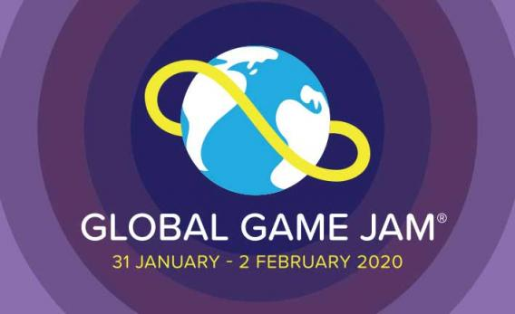
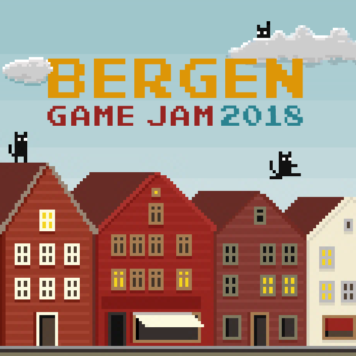
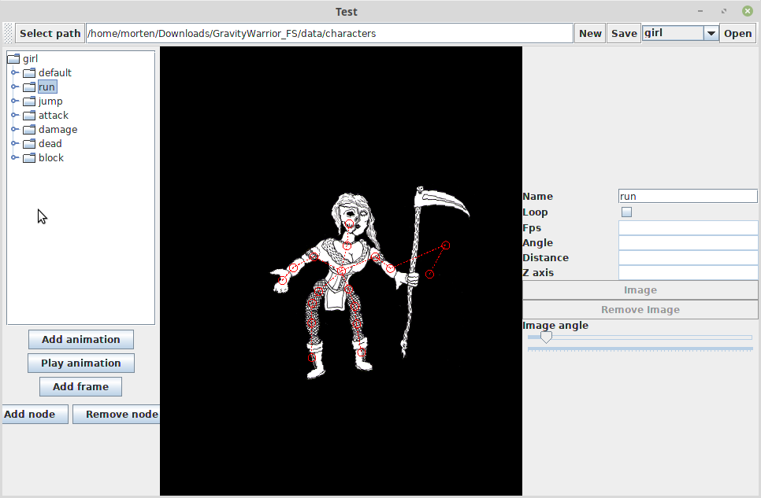
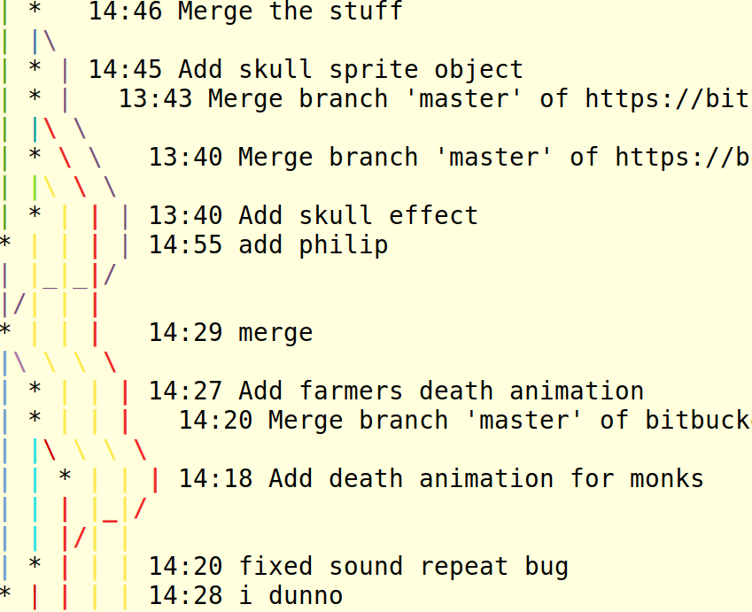
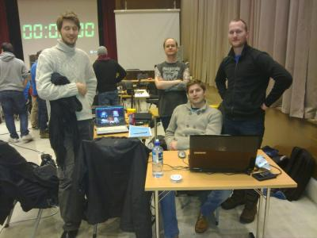
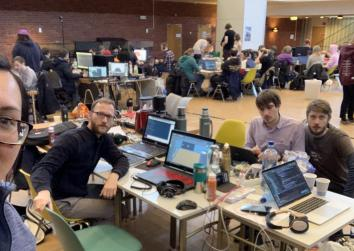
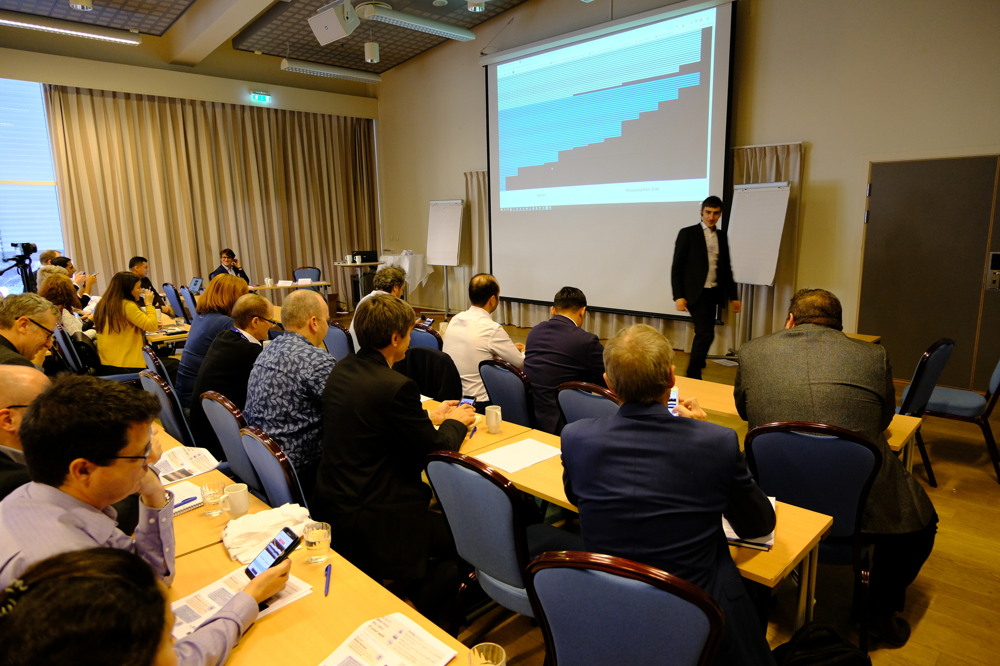
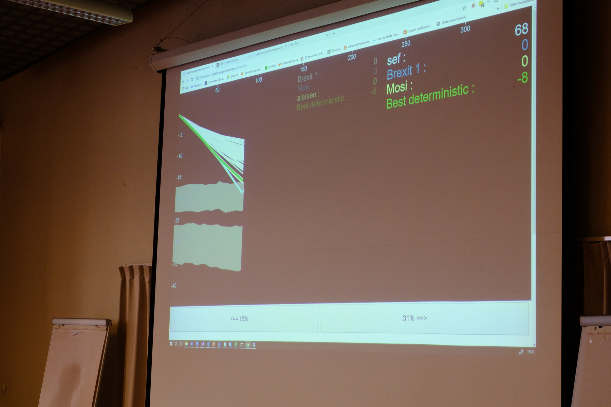
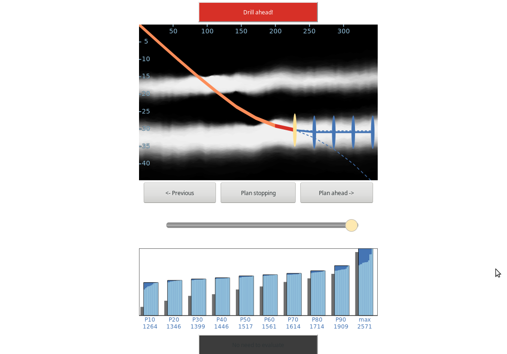

:title: GameJam Craftsmanship
:author: Morten Bendiksen
:description: Presentation about Game Jam and software craftsmanship
:keywords: game jam, software craftsmanship
:css: my.css

-----

:data-x: r1600
:data-y: r0

Game Jame Craftsmanship
=======================

A programmers experience

.. note::
  In this presentation, I will talk about what a Game Jam is and how I see it relating to
  software craftsmanship. This is my perspective after participating in programmer heavy
  groups.

-----

Game Jam events
===============

.. class:: substep

  You form a team

  A theme is revealed

  You have limited time (e.g. 48 hours) to make a game

  You present what you made

  Not a competition

-----

Global Game Jam
===============

.. note::

  I have participated in Global Game Jam. This is a yearly event where people
  in locations all over the world participate at the same time. Presentations
  are mostly local, and you upload your result to the ggj web page in the end.

-----

Bergen Game Jam
===============

.. note::

  Specifically I have attended the Bergen Game Jam which is one of the sites
  where the Global Game Jam is held every year.

-----

:data-x: 0
:data-y: r1000

Software Craftsmanship
======================

.. class:: substep
  
  * Not only **working software**

    * but also **well-crafted software**

.. note::

  Now I would like to relate the experience of participating in a Game Jam
  to the concepts of software craftsmanshp. I will go through the concepts
  one by one, and talk a little of how my experience relates.
  
  Software craftsmanship builds on the ideas from the agile manifesto.

  Agile makes you focus on working software
  While craftsmanship wants you to also focus on creating
  well-crafted software

-----

:data-x: r1600
:data-y: r0

Well-crafted?
=============

.. code:: java

	if (!onGround && notOnGround())

.. note::

  Do we get well crafted software in a Game Jam?
  If you look at the code, you would say no, absolutely not.
  The code is probably as bad as you can imagine. It is difficult
  to show bad code withouth really trying to understand it, so I
  settled for this small example here.

  Me and a friend were coding on logic related to some animation
  triggering. As we are working, we are committing locally and
  mering every now and then. In one big merge conflict, we struggle
  to recreate the behaviour we had just made. We suddenly 
  realize that we have to write this line you see here to get it
  working. Someone else had changed things around, so that the
  concepts we needed now had the same name.

  We didn't really understand how our own code worked any more 10 minutes
  after writing it, but it did seem to work, so we continued with something
  else.

  You can imagine how messy the code gets in the end when 
  there commits and merges flying back and forth by the minute,
  and the only coordination you have is screaming your thoughts and hoping
  someone cares.

-----

Working?
========

.. raw:: html
  
  <iframe width="90%" height="70%" src="https://www.youtube.com/embed/uHjuzZG-Imo" frameborder="0" allow="accelerometer; autoplay; encrypted-media; gyroscope; picture-in-picture" allowfullscreen></iframe>

.. note::

  Half of the features in this game is actually a bug. Dont tell.

  - Working:
    
    - an interresting demo is the goal, which usually all acomplish
    - even if it doesnt run, it can be presented
  
  - Well-crafted:
    
    - code is ugly, but is as nice as required
    - tech debt: if you never repay it

-----

:data-x: 0
:data-y: r1000

Software Craftsmanship
======================

- Not only working software

  - but also well-crafted software

.. class:: substep
    
- Not only **responding to change**

  - but also **steadily adding value**

-----

:data-x: r1600
:data-y: r0

Responding to change?
=====================

.. raw:: html

  <iframe width="90%" height="70%" src="https://www.youtube.com/embed/j_SVPSPbakQ" frameborder="0" allow="accelerometer; autoplay; encrypted-media; gyroscope; picture-in-picture" allowfullscreen></iframe>

.. note::

  Making this game Gravity Warrior, we had the idea that we would
  make a game with mythological figures fighting it out amids planets.
  Since the artist we worked with preferred making ink drawings on paper,
  we let that really impact the look of the game. But also in order to use
  his drawing we had to find a scanner, and then we created a separate peice
  of software to create animations out of static images pieced together.

-----

Responding to change?
=====================

.. note::

  This editor was absolutely barebones, and had a million bugs. The code
  for both it and the game was very hard to read and work with at the end.
  But, adding anything after deadline is not the plan. So you actually 
  want to end up in that position where you can't really do more at the end.
  Otherwise you have probably wasted time thinking things over that don't need
  it.

  Important in GJ:
  Forseeing what others need to be productive, and acting on it
  Team spirit is very important

-----

Steadily adding value?
======================

.. note::

  remember after the deadline there will be noe more, 
  and usually we're not able to do much more, because of the mess

-----

:data-x: 0
:data-y: r1000

Software Craftsmanship
======================

- Not only working software

  - but also well-crafted software
  
- Not only responding to change

  - but also steadily adding value 

.. class:: substep
    
  - Not only **individuals and interactions**
  
    - but also a **community of professionals**

-----

:data-x: r1600
:data-y: r0

Individuals and interactions?
=============================

-----

Individuals and interactions?
=============================

Trust in team members is important.

.. class:: substep

  - scream when you need something
  - answer if you can

-----

Community of professionals?
===========================

.. class:: substep

  Supporting each other

  Focusing on strengths

  Working around limitations

-----

:data-x: 0
:data-y: r1000

Software Craftsmanship
======================

- Not only working software

  - but also well-crafted software
  
- Not only responding to change

  - but also steadily adding value 
  
- Not only individuals and interactions

  - but also a community of professionals
  
.. class:: substep
  
  - Not only **customer collaboration**

    - but also **productive partnerships**

-----

:data-x: r1600
:data-y: r0

Customer collaboration?
=======================

Other participants

Organisers

-----

Productive partnerships?
========================

Help other teams

Learn to use strengths and work around weaknesses to get things done

See new opportunities

.. note::
  
  The other participants want to have fun during your presentation
  Teams are supposed to help each other, its not a competition
  You do get to see each others strengths and waknesses
  You get a lot of experience in forming parnership
  
-----

Productive partnerships?
========================

-----

Example: geosteering
====================

-----

Example: geosteering
====================

-----

Example: geosteering
====================

-----

:data-x: 0
:data-y: r1000

GameJam Craftsmanship
=====================

.. code:: c++

  reinterpret_cast
      <gamejam_craftsmanshp*>
        (&software_craftsmanship);

.. note::
  To round off.
  A new interpretation of software craftsmanship
  Since I'm not 100% sure what software_craftsmanship is,
  pobably undefined behaviour, but in the context of a game jam, that is often fun.

:data-x: r1600
:data-y: r0

-----

Well-craftedness
================

  - Hopefully does something, or at least presentable, hiding all the rough edges

    .. class:: substep
  
    - but realising that "well-crafted" must mean tailored to context and expectations

-----

Adding value
============

 - Adding value faster than f...

    .. class:: substep
 
   - but realising value is primarilly born out of enabling ones team-mates

-----

Community of professionals
==========================

 - A community of people who often have no idea what they are doing

   .. class:: substep
 
   - but forgetting individual limitations and supporting each others strenghts

-----

Productive partnerships
=======================

  - A desire for forming partnerships is good

    .. class:: substep
  
    - but experiences worth remembering is where the desire comes from

.. note::

  You have to get something done. This will involve the ugliest code you will ever write.
  That is OK. You get a feeling for the extreme end of what is called technical debt.
  Viktig at det er gøy i starten.
  Innebærer "dårlig" kode
  Teknisk "gjeld" bygger seg opp veldig raskt
  På slutten skjønner ingen koden lengre
  Planlagt at på slutten skal det være minst mulig forståelig kode
  Minimalt med "prosess"
  Live diskusjon i stedet for tasks/issues/tickets
  Går lynraskt
  ganske slitsomt
  i stedet for planlegging, skriking og roping
  ad hoc grupper former seg innad i teamet

